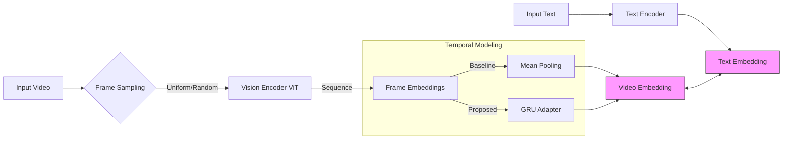

test feature link: https://drive.google.com/drive/folders/1ii8c1-YKGG7zxOQiPrHU2N3thyY2DZBL?usp=sharing

# 📹 CLIP-based Video-Text Retrieval Analysis

> **CLIP 기반 Video-Text 검색에서 프레임 샘플링과 시간적 표현 기법이 성능에 미치는 영향 분석**
>
> *Analyzing the Impact of Frame Sampling and Temporal Representation Techniques on Performance in CLIP-based Video-Text Retrieval*

---

## 📂 Source Code & Model Weights

본 리포지토리는 KAICTS 2025 학술대회 발표 논문의 실험 코드를 포함하고 있습니다.

| Type | File | Description |
| :--- | :--- | :--- |
| **Proposed** | 📄 **[GRU.ipynb](./GRU.ipynb)** | **제안 모델:** GRU Adapter + Attention Pooling 구현 코드 |
| **Baseline** | 📄 **[Meanpooling.ipynb](./Meanpooling.ipynb)** | **비교 모델:** Frame Mean Pooling 구현 코드 |
| **Weights** | 💾 **[GRU_adapter3_32f_hidden1024.pth](./GRU_adapter3_32f_hidden1024.pth)** | 학습이 완료된 GRU Adapter 모델 가중치 파일 |

---

## 📖 Abstract

최근 CLIP 기반 모델은 비디오-텍스트 검색에서 주목받고 있으나, 기존 연구들은 선택된 프레임 특징을 단순 평균(Mean Pooling)하여 **시간적 정보(Temporal Information)가 반영되지 않는 한계**가 있습니다.

본 연구는 **MSR-VTT 데이터셋**을 활용하여 다음 세 가지 요소가 검색 성능에 미치는 영향을 체계적으로 분석했습니다.
1.  **Sampling Strategy:** Uniform vs Random
2.  **Frame Count:** 8, 16, 32 frames
3.  **Temporal Representation:** Mean Pooling vs **GRU (Proposed)**

실험 결과, **GRU 기반 모델이 Uniform Sampling 32프레임 설정에서 R@1 32.0%를 기록**하며, 단순 평균 방식(28.0%) 대비 **4%p**의 성능 향상을 보였습니다. 이는 시간적 정보 학습이 비디오 표현 향상에 효과적임을 시사합니다.

---

## 🏗️ Model Architecture

본 프로젝트는 사전 학습된 **CLIP (ViT-B/16)**을 백본으로 사용하며, 두 가지 접근 방식을 비교 분석하였습니다.

### 1. Baseline (Mean Pooling)
* 각 프레임의 임베딩을 추출한 후 단순 평균(Mean)하여 비디오 임베딩 생성.
* 시간적 순서 정보를 고려하지 않음.

### 2. Proposed (GRU Adapter)
* **Structure:** CLIP Image Encoder (Freeze) → **GRU** → Attention Pooling → Video Embedding
* **Mechanism:** 프레임 시퀀스의 순차적 의존성을 학습하여 시간적 문맥을 반영.
* **Training:** CLIP 인코더는 고정하고, GRU 모듈과 Learnable Temperature만 업데이트.

