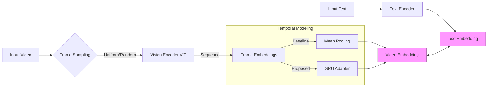

# 📹 CLIP-based Video-Text Retrieval Analysis

> **CLIP 기반 Video-Text 검색에서 프레임 샘플링과 시간적 표현 기법이 성능에 미치는 영향 분석**
>
> *Analyzing the Impact of Frame Sampling and Temporal Representation Techniques on Performance in CLIP-based Video-Text Retrieval*

---

## 📂 Source Code & Model Weights

본 리포지토리는 KAICTS 2025 학술대회 발표 논문의 실험 코드를 포함하고 있습니다.

| Type | File | Description |
| :--- | :--- | :--- |
| **Proposed** | 📄 **[GRU.ipynb](./GRU.ipynb)** | **제안 모델:** GRU Adapter + Attention Pooling 구현 코드 |
| **Baseline** | 📄 **[Meanpooling.ipynb](./Meanpooling.ipynb)** | **비교 모델:** Frame Mean Pooling 구현 코드 |
| **Weights** | 💾 **[GRU_adapter3_32f_hidden1024.pth](./GRU_adapter3_32f_hidden1024.pth)** | 학습이 완료된 GRU Adapter 모델 가중치 파일 |

---

## 📖 Abstract

최근 CLIP 기반 모델은 비디오-텍스트 검색에서 주목받고 있으나, 기존 연구들은 선택된 프레임 특징을 단순 평균(Mean Pooling)하여 **시간적 정보(Temporal Information)가 반영되지 않는 한계**가 있습니다.

본 연구는 **MSR-VTT 데이터셋**을 활용하여 다음 세 가지 요소가 검색 성능에 미치는 영향을 체계적으로 분석했습니다.
1.  **Sampling Strategy:** Uniform vs Random
2.  **Frame Count:** 8, 16, 32 frames
3.  **Temporal Representation:** Mean Pooling vs **GRU (Proposed)**

실험 결과, **GRU 기반 모델이 Uniform Sampling 32프레임 설정에서 R@1 32.0%를 기록**하며, 단순 평균 방식(28.0%) 대비 **4%p**의 성능 향상을 보였습니다. 이는 시간적 정보 학습이 비디오 표현 향상에 효과적임을 시사합니다.

---

##  Model Architecture

본 프로젝트는 사전 학습된 CLIP (ViT-B/16)을 백본으로 사용하며, 두 가지 접근 방식을 비교 분석하였습니다.

### 1. Baseline (Mean Pooling)
* 각 프레임의 임베딩을 추출한 후 단순 평균(Mean)하여 비디오 임베딩 생성.
* 시간적 순서 정보를 고려하지 않음.

### 2. Proposed (GRU Adapter)
* **Structure:** CLIP Image Encoder (Freeze) → **GRU** → Attention Pooling → Video Embedding
* **Mechanism:** 프레임 시퀀스의 순차적 의존성을 학습하여 시간적 문맥을 반영.
* **Training:** CLIP 인코더는 고정하고, GRU 모듈과 Learnable Temperature만 업데이트.

---

## Experimental Setting

### Dataset
본 연구는 **MSR-VTT (Microsoft Research Video to Text)** 데이터셋을 사용하여 실험을 진행했습니다.

* **Composition:** 총 10,000개의 비디오 클립과 영상당 20개의 캡션으로 구성.
* **Split:**
    * **Train/Val:** 7,000개 (Temporal Adapter 학습)
    * **Test:** 1,000-A split (성능 평가)
* **Preprocessing:** 일관된 학습을 위해 각 비디오의 첫 번째 캡션만을 사용했습니다.

### Hyperparameters
실험 환경 및 주요 하이퍼파라미터 설정은 다음과 같습니다.

| Category | Setting |
| :--- | :--- |
| **Backbone** | CLIP (ViT-B/16, Pretrained) |
| **Input Frames** | 8, 16, 32 |
| **Sampling** | Uniform vs Random |
| **Optimizer** | AdamW ($lr=1\times10^{-4}$) |
| **Loss Function** | Contrastive Loss |
| **Batch Size** | 32 |
| **Patience** | 5 (Early Stopping) |
| **Hardware** | NVIDIA A100 GPU |

---

## 📊 Results & Analysis

### Main Results (Video-to-Text)
프레임 수, 샘플링 방식, 그리고 시간적 표현 기법(Mean Pooling vs GRU)에 따른 성능 비교 결과입니다.

| Model | Sampling | Frames | R@1 | R@5 | R@10 | MnR ↓ |
| :--- | :--- | :---: | :---: | :---: | :---: | :---: |
| **Mean Pooling** | Uniform | 8 | 26.4 | 51.0 | 62.9 | 34.8 |
| | | 16 | 27.3 | 52.6 | 63.8 | 34.6 |
| | | 32 | 28.0 | 52.2 | 64.1 | 34.3 |
| | Random | 8 | 27.1 | 51.9 | 62.8 | 36.2 |
| | | 16 | 28.6 | 52.1 | 62.6 | 36.2 |
| | | 32 | 27.1 | 52.3 | 64.0 | 34.6 |
| **GRU (Ours)** | **Uniform** | **8** | 28.1 | 55.0 | 66.0 | 36.3 |
| | | **16** | 29.9 | 58.3 | 68.8 | 32.6 |
| | | **32** | **32.0** | **58.9** | **69.0** | **29.0** |
| | Random | 8 | 30.2 | 55.3 | 67.2 | 36.2 |
| | | 16 | 30.2 | 51.8 | 62.5 | 50.9 |
| | | 32 | 30.3 | 52.5 | 64.6 | 55.2 |

### Key Findings
1.  **Effect of Temporal Modeling:** GRU 모델은 모든 구간에서 Mean Pooling보다 우수한 성능을 보였으며, 특히 Uniform 32f 설정에서 R@1 기준 4.0%p 향상 (28.0% → 32.0%)을 달성했습니다.
2.  **MnR Improvement:** 검색 순위의 평균을 나타내는 MnR 지표 또한 34.3에서 **29.0**으로 크게 개선되었습니다.
3.  **Frame Count:** 프레임 수가 많을수록(8→32) 더 풍부한 정보를 반영하여 성능이 향상되었습니다.

---

## 🚀 Qualitative Results

모델의 실제 검색 성능을 확인하기 위한 정성적 평가 결과입니다.

* **Video-to-Text:** "Grand Theft Auto V" 게임 주행 영상에 대해 *"someone is driving the city in grand theft auto v"* 문장을 정확히 매칭 (Similarity: 0.42).

* **Text-to-Video:** *"a woman preparing a duck to roast"* 쿼리에 대해 요리 준비 과정이 담긴 비디오를 정확히 매칭. (Similarity: 0.28).

* **Analysis:** 제안 모델이 양방향 검색(Video↔Text) 모두에서 의미적 맥락을 정확히 파악함을 확인했습니다.

---

## Future Work

* **Advanced Modules:** 단방향 GRU의 한계를 넘어 양방향 문맥을 고려하는 Bi-GRU 및 Transformer 기반 시간 모듈 확장 적용.
* **Adaptive Sampling:** Scene-based 또는 Motion-aware와 같은 다양한 샘플링 전략 실험.
* **Generalization:** 대규모 비디오 데이터셋을 활용한 일반화 성능 검증.

---

## 📝 Acknowledgments & Citation

본 연구는 과학기술정보통신부 및 정보통신기획평가원의 **SW중심대학사업** 지원을 받아 수행되었습니다 (2024-0-00047).

**Authors:**
* **Jeong Ayeong** (Dept. of Medical AI, Konyang Univ.)
* **Kim Junhwa** (Dept. of AI, Konyang Univ.)

**Conference:**
* KAICTS 2025 (Korea Artificial-Intelligence Convergence Technology Society)
---

test feature link: https://drive.google.com/drive/folders/1ii8c1-YKGG7zxOQiPrHU2N3thyY2DZBL?usp=sharing

